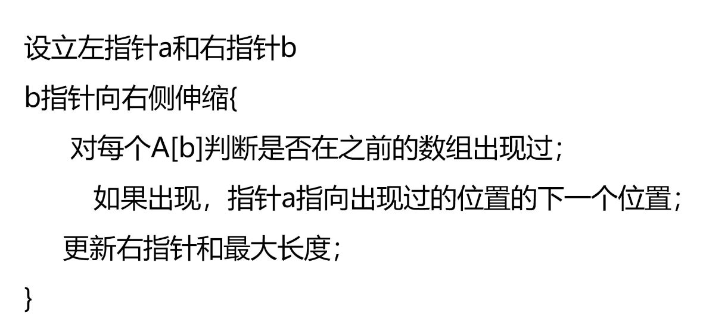

#### 题目
给定一个字符串 s ，请你找出其中不含有重复字符的 最长子串。输出该 最长子串 及其长度。
#### 限定
1. 0 <= s.length <= 5 * 104
2. s 由英文字母、数字、符号和空格组成

参考题解：[链接](https://leetcode.cn/problems/longest-substring-without-repeating-characters/solution/wu-zhong-fu-zi-fu-de-zui-chang-zi-chuan-cshi-xian-/)

#### 直接法暴力求解

第一次循环，得到字符串所有的子串；
第二次循环，判断每个字符串中是否存在重复字符，若存在则舍去；
第三次循环，计算剩下的所有字符串长度，保留最长的字符串。

#### 思路：滑动窗口

时间复杂度 $O(n^2)$；空间复杂度 O(1)

#### 改进：使用hash表代替“判断是否存在相同元素”

关于哈希表及其在 C++ 中的实现：[链接](https://blog.csdn.net/a130737/article/details/38731879)
时间复杂度 $O(n)$；空间复杂度 O(n)