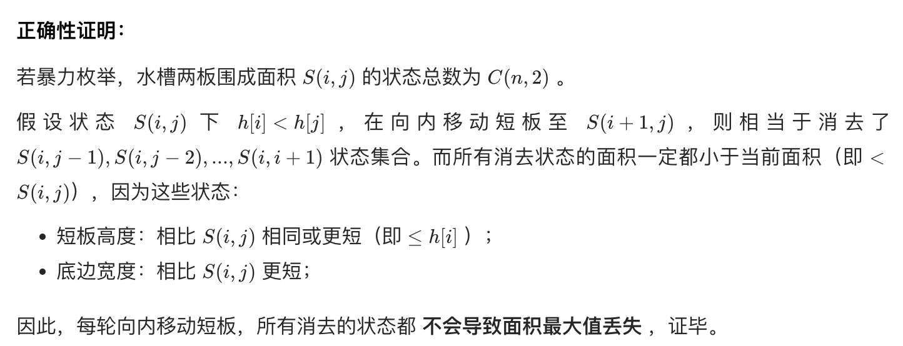

#### 题目

给定一个长度为 n 的整数数组 height 。有 n 条垂线，第 i 条线的两个端点是 (i, 0) 和 (i, height[i]) 。

找出其中的两条线，使得它们与 x 轴共同构成的容器可以容纳最多的水。

返回容器可以储存的最大水量。

#### 限制
1. 你不能倾斜容器。
2. n == height.length
3. 2 <= n <= 105
4. 0 <= height[i] <= $10^4$

#### 示例
输入：[1,8,6,2,5,4,8,3,7]
输出：49 
解释：图中垂直线代表输入数组 [1,8,6,2,5,4,8,3,7]。在此情况下，容器能够容纳水（表示为蓝色部分）的最大值为 49。

#### 思路

最直接地暴力求解:
1. 排列组合穷举所有可能：两次循环 - $O(N^2)$
2. 取出每种组合情况，记录截到的雨水量 - $O(N^2)$
   
从奥数的角度思考，参考 [链接](https://leetcode.cn/problems/container-with-most-water/solution/container-with-most-water-shuang-zhi-zhen-fa-yi-do/)，其中关键点在于：
1. 可容纳水的高度由两板中的**短板** 决定
2. 若向内移动短板，下个水槽的面积可能增大；若向内移动长板，下个水槽的面积一定变小。
3. 因此，初始化双指针分列水槽左右两端，循环每轮将短板向内移动一格，并更新面积最大值，直到两指针相遇时跳出；即可获得最大面积。

#### 正确性证明

